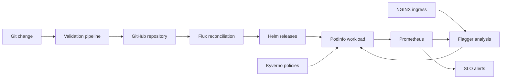

# Platform Blueprint

[](https://github.com/kyan9400/platform-blueprint/actions/workflows/ci.yml)

An opinionated GitOps reference platform for running a real Kubernetes workload with progressive delivery, admission controls, observability, and a reproducible cloud path.

The demo workload is [Podinfo](https://github.com/stefanprodan/podinfo), consumed as a versioned OCI Helm chart. This repository owns the platform layer around it: cluster reconciliation, release safety, policies, SLOs, local automation, and AWS infrastructure as code.

## What it demonstrates

| Capability | Implementation |
| --- | --- |
| Reproducible local cluster | kind configuration and one-command bootstrap scripts |
| GitOps | Flux pulls declared cluster state and continuously reconciles drift |
| Progressive delivery | Flagger shifts NGINX traffic in measured steps and rolls back on failed checks |
| Supply-chain discipline | OCI chart digest pinning, fixed tool versions, immutable GitHub Action SHAs, Trivy scans |
| Workload security | Restricted Pod Security Standards, Kyverno CEL admission policies, default-deny network policy |
| Reliability | Probes, resource bounds, disruption budget, Prometheus SLO rules, runbooks |
| Cloud path | Terraform for a private-endpoint Amazon EKS cluster and managed node group |
| Verification | Manifest rendering, schema checks, policy tests, Terraform validation, and a kind smoke test |

## Architecture



Flux owns desired state. Flagger owns the rollout transaction. Prometheus supplies the release signal. Kyverno rejects workloads that omit the runtime controls defined in this repository.

## Quick start

Prerequisites: Docker, `kubectl`, [kind](https://kind.sigs.k8s.io/), and the [Flux CLI](https://fluxcd.io/flux/installation/).

PowerShell:

```powershell
./scripts/bootstrap-local.ps1
./scripts/smoke-test.ps1
```

Bash:

```bash
./scripts/bootstrap-local.sh
./scripts/smoke-test.sh
```

The bootstrap creates a cluster named `platform-blueprint`, installs Flux, and points it at this repository. After reconciliation:

```bash
curl -H "Host: podinfo.local" http://127.0.0.1
kubectl -n platform-demo describe canary podinfo
flux get kustomizations
```

Prometheus and Grafana are available through explicit port-forwards:

```bash
kubectl -n monitoring port-forward svc/kube-prometheus-stack-prometheus 9090:9090
kubectl -n monitoring port-forward svc/kube-prometheus-stack-grafana 3000:80
```

Grafana allows anonymous Viewer access in this local lab only. Do not reuse that setting in a shared environment.

## Trigger a canary

Change the Podinfo version and OCI digest in `apps/podinfo/base/source.yaml`, then change `spec.values.image.tag` in `apps/podinfo/base/release.yaml`. Commit and push the change. Flux reconciles it, and Flagger starts a canary that advances only while its success-rate and latency checks pass.

Watch the rollout:

```bash
kubectl -n platform-demo get canary podinfo --watch
kubectl -n platform-demo describe canary podinfo
```

The exact recovery procedures are in [docs/runbooks/canary-rollback.md](docs/runbooks/canary-rollback.md) and [docs/runbooks/flux-reconciliation.md](docs/runbooks/flux-reconciliation.md).

## Validate without a cluster

```powershell
./scripts/verify.ps1
```

```bash
./scripts/verify.sh
```

CI adds schema validation, Kyverno policy tests, Terraform validation, a critical-severity configuration scan, and an end-to-end kind deployment.

## AWS EKS path

The Terraform example creates networking and an EKS managed node group with a private Kubernetes API endpoint by default. It is intentionally not auto-applied by CI.

```bash
cd infrastructure/terraform/aws-eks
terraform init -backend=false
terraform validate
terraform plan -var='environment=staging'
```

Review the plan, configure a remote encrypted state backend, and obtain explicit approval before any apply. See [infrastructure/terraform/aws-eks/README.md](infrastructure/terraform/aws-eks/README.md).

## Repository map

```text
apps/                     Podinfo base and local/staging/production overlays
clusters/local/           kind cluster and Flux reconciliation graph
infrastructure/controllers/ Helm-managed platform controllers
infrastructure/terraform/ Optional AWS EKS infrastructure
observability/            Prometheus rules and Grafana dashboard
policies/                 Enforced Kyverno workload standards
scripts/                  Bootstrap, smoke, verification, and teardown
tests/policies/           Positive and negative admission-policy tests
docs/                     Architecture, decisions, threat model, and runbooks
```

## Design boundaries

- This is a reference platform, not evidence of a running production cluster.
- Local kind networking does not enforce `NetworkPolicy`; use a compatible CNI in shared clusters.
- The workload has no application secrets. Cloud deployments should add a secret-store integration rather than committing Kubernetes `Secret` objects.
- Production changes remain pull-request driven; CI never runs `terraform apply` or pushes directly to a cluster.

## Upstream

Podinfo is maintained by Stefan Prodan and contributors under Apache-2.0. It is referenced as an external OCI artifact; its source is not copied or renamed here. See [THIRD_PARTY_NOTICES.md](THIRD_PARTY_NOTICES.md).

## License

Platform Blueprint is available under the [MIT License](LICENSE).
