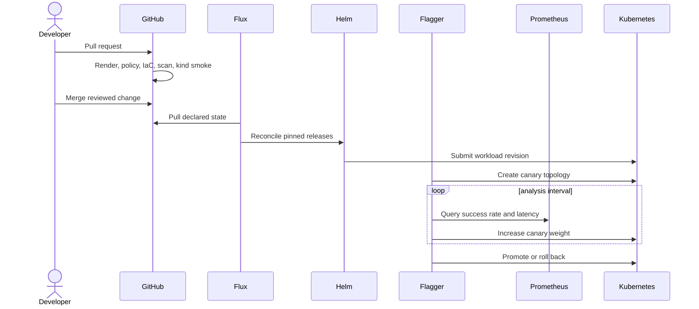

# Architecture

## Control flow

1. A pull request changes declarative state.
2. CI renders every environment, validates Kubernetes schemas and Kyverno behavior, checks Terraform, and scans configuration.
3. Flux pulls the merged revision and reconciles platform controllers before policies, observability, and applications.
4. Helm Controller installs an OCI chart fixed to a content digest.
5. Flagger detects a workload revision and creates the primary/canary service topology.
6. NGINX shifts traffic while Prometheus reports success rate and latency.
7. Flagger promotes a healthy revision or restores the primary revision when the failure threshold is reached.



## Reconciliation dependencies

```text
platform-controllers
├── policy-guardrails
├── observability
└── demo-workload
    ├── requires policy-guardrails
    └── requires observability
```

Flux `dependsOn` edges keep application resources from racing controller CRDs and admission webhooks.

## Environment model

The base contains invariant workload controls. Kustomize overlays change only environment-specific scale, hostname, presentation, and rollout tolerance:

| Environment | Replicas | Canary maximum | Step | Intended use |
| --- | ---: | ---: | ---: | --- |
| local | 2 | 50% | 10% | Fast feedback |
| staging | 2 | 50% | 10% | Integration verification |
| production | 3 | 20% | 5% | Conservative rollout |

## Trust boundaries

- GitHub is the desired-state and review boundary.
- Flux service accounts are the cluster mutation boundary.
- Kyverno is the workload admission boundary.
- NGINX is the external traffic boundary.
- Prometheus metrics are release inputs, not application authorization inputs.

See [threat-model.md](threat-model.md) for controls and remaining risks.
